# 交易在MetaMask上一直等待

交易一直处于等待状态无法被网络打包一般有三种原因

1. 交易的Nonce不是下一个应该被打包的Nonce
2. 交易的Gas Price为0
3. 交易的Gas Limit不足

您可以根据下述步骤检查您遇到的是哪个问题

## 检查交易的Nonce

1. 打开[https://scan.genechain.io](https://scan.genechain.io)，在右上角查询框输入您的地址查询您的交易历史  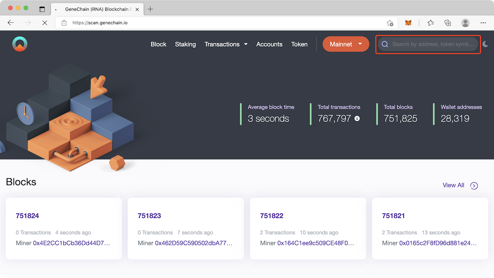 
2. 找到最新一个您发送的交易，点击交易哈希查看这个交易的详细信息，**请注意**：确保图中1处是你的帐号地址，因为其他人给你发送的交易也会出现在这里。然后点击图中2处即可查询交易详细信息  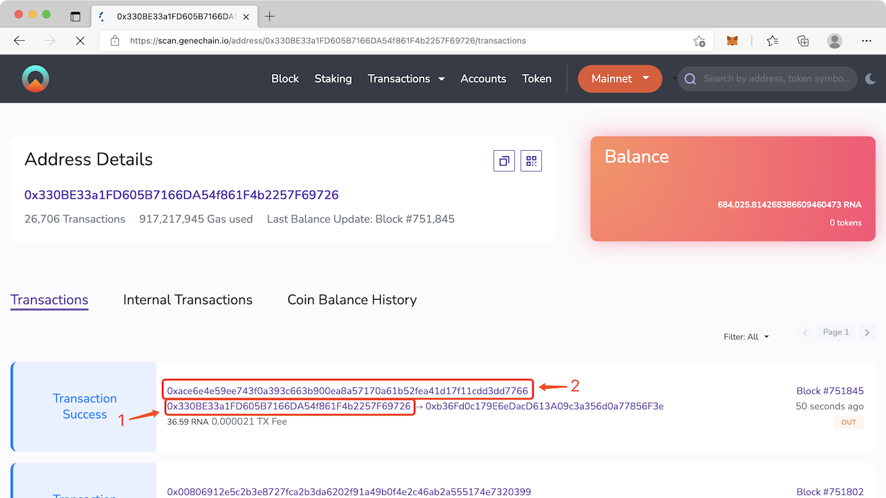 
3. 记录这个交易的Nonce值，假设为`N`，下一个被打包的交易的Nonce值只能比这个值大1  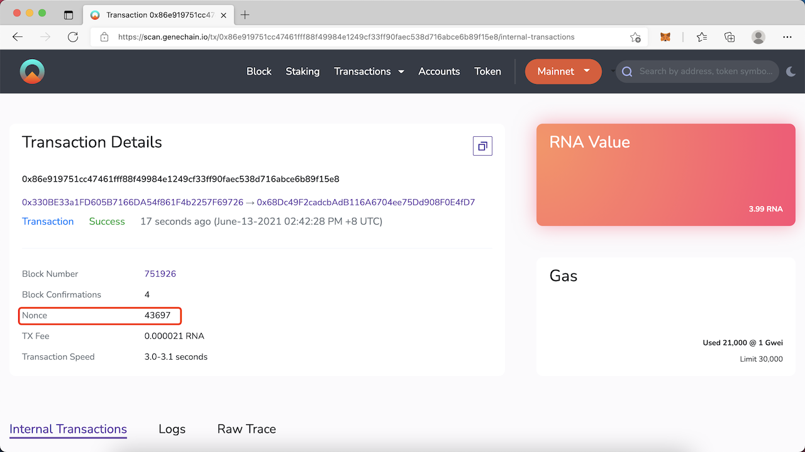
4. 打开MetaMask查询交易历史，桌面版MetaMask可以点击`活动`查看队列中的交易，移动版MetaMask需要点击菜单中的`交易历史记录`  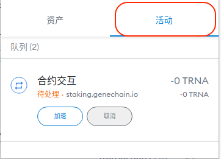 
5. 点击最靠上的交易，这通常是MetaMask中被阻塞的第一个交易  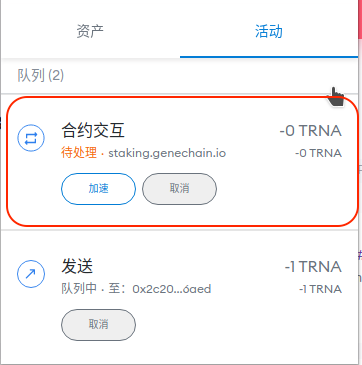 
6. 检查这个交易的Nonce值，假设为`M`  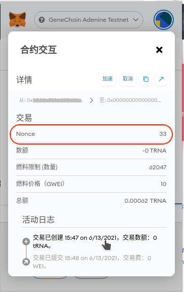 

如果发现阻塞的交易Nonce（`M`）和最后一个被打包的交易Nonce（`N`）不连续，即`M≠N+1`，则需要[自定义Nonce](jiao-yi-zai-metamask-shang-yi-zhi-deng-dai.md#custom-nonce)或[重置Nonce](jiao-yi-zai-metamask-shang-yi-zhi-deng-dai.md#reset-nonce)后重新发送Nonce为`N+1`的交易，建议先尝试[自定义Nonce](jiao-yi-zai-metamask-shang-yi-zhi-deng-dai.md#custom-nonce)，如果无法解决问题再尝试[重置Nonce](jiao-yi-zai-metamask-shang-yi-zhi-deng-dai.md#reset-nonce)。

如果Nonce是连续的，即`M=N+1`，可继续进行Gas Price和Gas Limit的检查

## 检查Gas Price

建议先检查Gas Price（燃料价格），此数为0时会无法被网络打包，请参考[加速或取消交易](jiao-yi-zai-metamask-shang-yi-zhi-deng-dai.md#speed-up-or-cancel)，调高Gas Price来让网络打包此交易。

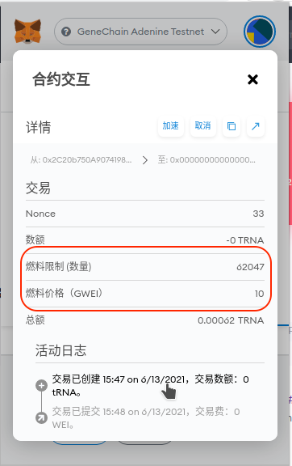

如果Gas Price不为0，则通常原因是Gas Limit太低，导致网络无法打包交易。请参考[加速或取消交易](jiao-yi-zai-metamask-shang-yi-zhi-deng-dai.md#speed-up-or-cancel)，调高Gas Limit的同时调高Gas Price来让网络打包此交易。

## 加速或取消交易 

点击待处理交易下方的`加速`或`取消`按钮

在加速或取消时点击`高级`增加Gas Price（每次增加1即可）和Gas Limit（每次建议增加0.5倍以上）尝试让网络能够正常打包这笔交易。

**注意**：移动端MetaMask可以点击`加速`和`取消`，但并不可以在加速或取消时自定义Gas Price，因此很有可能不成功，此时建议[自定义Nonce](jiao-yi-zai-metamask-shang-yi-zhi-deng-dai.md#custom-nonce)后重新发送交易。

## 自定义Nonce以覆盖交易 

在设置中打开自定义Nonce后即可手工填写一个交易的Nonce，具体步骤如下

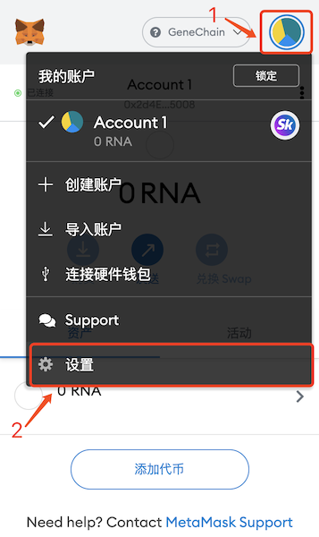 

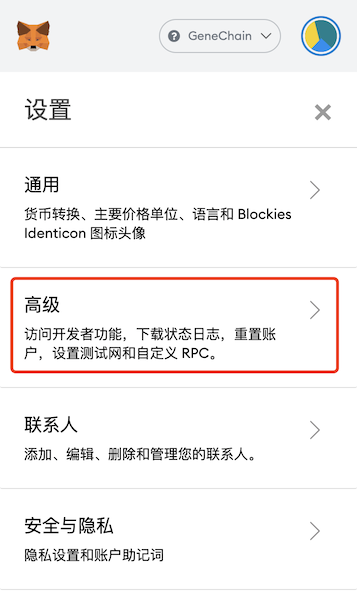 

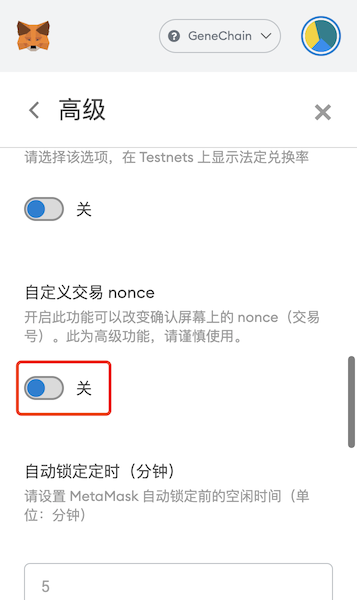

打开自定义交易Nonce的开关后即可在发送交易时填入需要的Nonce，此时执行你需要做的操作，在发送交易时填入下一个Nonce，**务必记得调高**Gas Price（需要比之前在网络是阻塞住的交易的Gas Price大1即可，否则会遇到`replacement transaction underpriced`错误）和Gas Limit（每次建议增加0.5倍以上，否则可能还会遇到阻塞问题）

 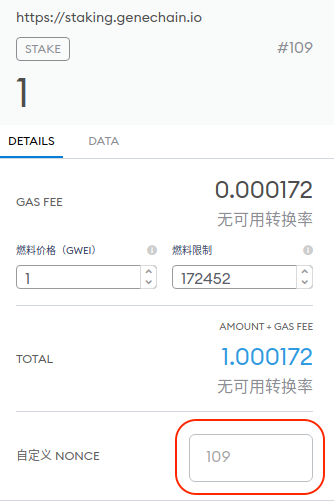 

## 重置Nonce 

如果无法加速或取消或仍然得不到打包，在这种情况下，您可以在`设置 -> 高级`中单击`重设帐户`即可重置Nonce。此操作将重置您的随机数并清除您的交易历史记录，但不会更改帐户中的余额或要求您重新输入助记词。

重置Nonce值后即可重新发送交易覆盖网络上在排队的同Nonce的交易，此时请记得调高Gas Price以覆盖网络上在排队的交易，避免因新交易的Gas Price不比旧交易高而遇到REPLACEMENT\_UNDERPRICED无法覆盖之前旧交易的错误。  

如果您使用移动端MetaMask遇到重置Nonce无效的情况，建议使用桌面端尝试或重新安装移动端MetaMask。但请记得提前保存好您的私钥或助记词。

如果调高Gas Price后或未调整时遇到CALL\_EXCEPTION错误，通常是因为MetaMask在预估Gas Limit时比实际执行所需要的Gas低，导致执行不成功。此时，需要调高Gas Limit可以帮助解决问题。

