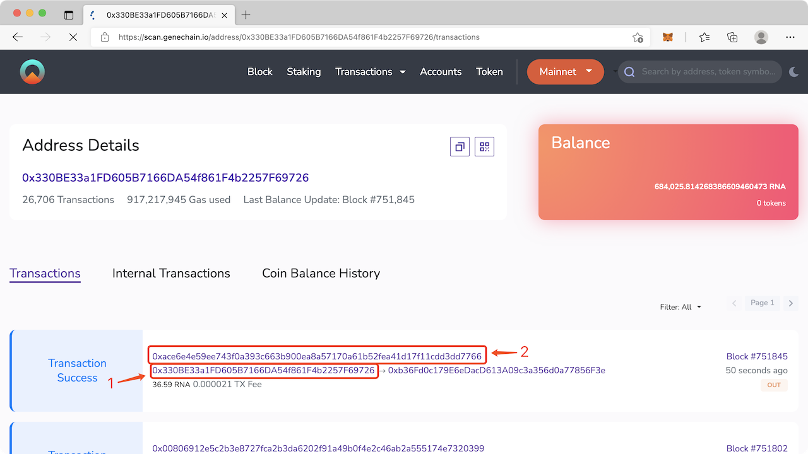
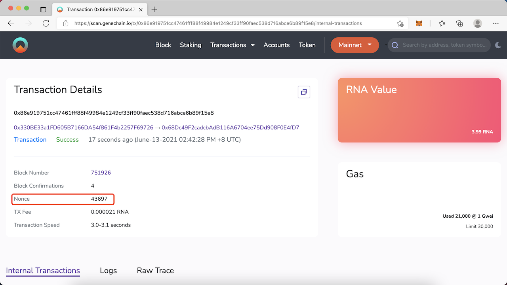
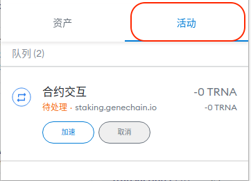
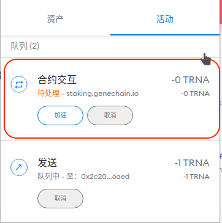
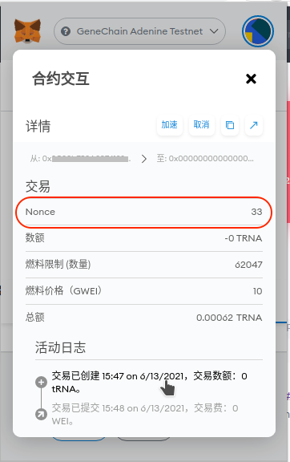
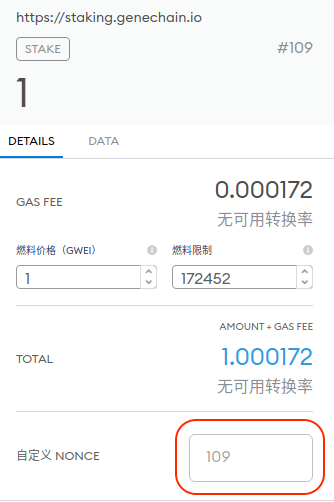

# Transaction always pending on MetaMask

There are usually three reasons why transactions have been pending and cannot be packaged by the network.

1. The Nonce of the transaction is not the next Nonce that should be packaged
2. The gas price of the transaction is 0
3. Insufficient gas limit for transaction

You can check which problem you are experiencing according to the following steps

## Check Nonce

Open [https://scan.genechain.io](https://scan.genechain.io) and enter your address in the query box in the upper right corner to view your transaction history

Find the latest transaction you sent, and click the transaction hash to view the details of this transaction. Please note: Make sure that the number 1 in the figure is your account address, because transactions sent to you by other people will also appear here. Then click 2 in the figure to query the transaction details

 

Record the Nonce value of this transaction, assuming it is `N`, the Nonce value of the next packaged transaction can only be greater than this value by 1

 

Open MetaMask to query transaction history, MetaMask desktop can click on the activity to view transactions in the queue, MetaMask mobile needs to click on the transaction history in the menu.

 

Click on the top transaction in MetaMask, which is usually the first transaction blocked

 

Check the Nonce value of this transaction, suppose it is `M`

 

If the Nonce of blocked transaction \(M\) and the Nonce of last packaged transaction \(N\) are not continuous, that is, `M≠N+1`, you need to [custom the nonce](transaction-always-pending-on-metamask.md#custom-nonce) of [reset the Nonce](transaction-always-pending-on-metamask.md#reset-nonce) and resend the transaction with Nonce as `N+1`.

If Nonce is continuous, that is, `M=N+1`, you need to continue to check Gas Price and Gas Limit 

## Check Gas Price

It is recommended to check the Gas Price \(fuel price\) first. When Gas Price is 0, it will not be packaged by the network. Please refer to [Speed Up or Cancel](transaction-always-pending-on-metamask.md#speed-up-or-cancel) the transaction and increase the Gas Price to allow the network to package this transaction.

 

If the Gas Price is not 0, the usual cause is that the Gas Limit is too low, making the network unable to package transactions. Please refer to [Speed Up or Cancel](transaction-always-pending-on-metamask.md#speed-up-or-cancel) the transaction, increase the Gas Limit and increase the Gas Price at the same time to allow the network to package this transaction.

## **Speed Up or Cancel**

Click the `Speed Up` or `Cancel` button under the pending transaction

Click `Advanced` to increase Gas Price \(increase by 1 each time\) and Gas Limit \(increase by more than 0.5 times each time\) when accelerating or canceling, try to allow the network to pack this transaction normally. Note: You can click to speed up and cancel on MetaMask mobile, but you cannot customize the Gas Price during acceleration or cancellation, so it is very likely to be unsuccessful. At this time, it is recommended to [custom the nonce](transaction-always-pending-on-metamask.md#custom-nonce) and resend the transaction.

## Custome Nonce to Replace Transaction 

You can turn on Custom Nonce in the settings to fill in the Nonce of a transaction manually as following.

 

 

After turning on the switch of the custom transaction Nonce, you can fill in the required Nonce when sending the transaction. Fill in the next Nonce when sending a new transaction. **Remember** to increase the Gas Price \(needs to be higher than the pending transaction with the same nonce by at least 1, otherwise you will encounter the `replacement transaction underpriced` error\) and Gas Limit \(it is recommended to increase by more than 0.5 times, otherwise you may encounter the same pending problem\)

  

## **Reset Nonce**

If you cannot speed up or cancel or still cannot get packaged, in this case, you need to click `Reset Account` in `Settings -> Advanced` to reset the random number. This action will reset your random number and clear your transaction history, but will not change the balance in your account or require you to re-enter the mnemonic phrase.

After resetting the nonce value, you can resend the transaction covering the same nonce transaction that is queued on the network. At this time, please remember to increase the gas price to cover the transaction queued on the network to avoid the gas price of the new transaction not being higher than the old transaction which will lead to REPLACEMENT\_UNDERPRICED error and cannot overwrite the old transaction.  

If you are using MetaMask mobile and encounter the problem that resetting the nonce does not work, it is recommended to try the desktop version or reinstall MetaMask mobile. But DO REMEMBER to save your private key or mnemonic phrase in advance.

If you encounter a CALL\_EXCEPTION error after increasing the Gas Price or not, it is usually because MetaMask estimates the Gas Limit lower than the actual gas required. In this case, increasing gas limit might help.

