# Staking Guide

Staking can be accomplished by calling the `stake` method of the Ribose system contract. You can find more information in the contract [source code](https://github.com/genechain-io/system-contract/blob/master/contracts/Ribose.sol).

A simple way is to use the [staking page](https://staking.genechain.io). Here is a simple guide on how to use the staking page.

## Pre-request

MetaMask is required and needs to be configured properly before interacting with staking page. If not, follow the steps in [How to Use MetaMask](../metamask.md) to install and configure MetaMask first.

## Connect wallet

You need to connect the staking page with MetaMask which will authorize the staking page to use your account to interact with the Ribose system contract. This can be done through the following steps.

1. Click `Connnect Wallet` on [staking page](https://staking.genechain.io).   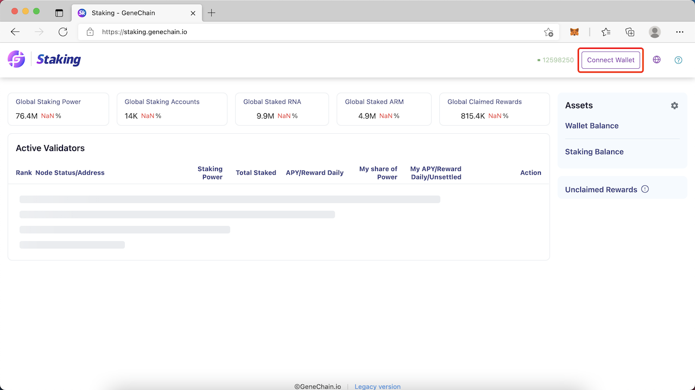 
2. Choose MetaMask  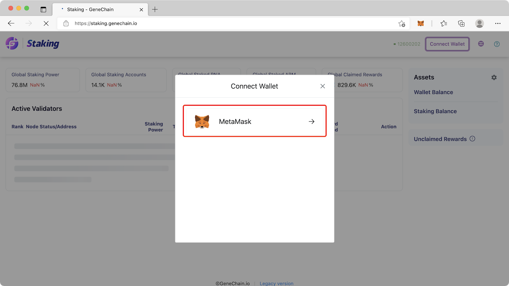 
3. Select the account you want to use and click `Next`.  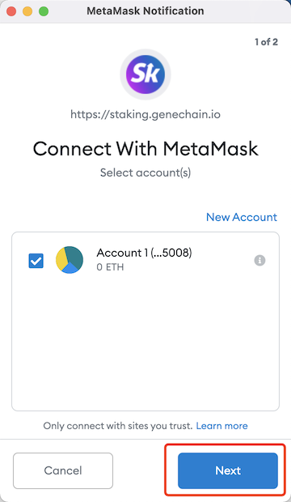 
4. Click `Connect` to finish the connection. 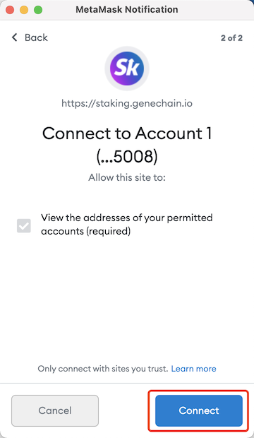

## Switch to GeneChain

Skip this if the network in MetaMask has already been switched to GeneChain.

1. Click `Switch to GeneChain Mainnet` to inform MetaMask to switch network.  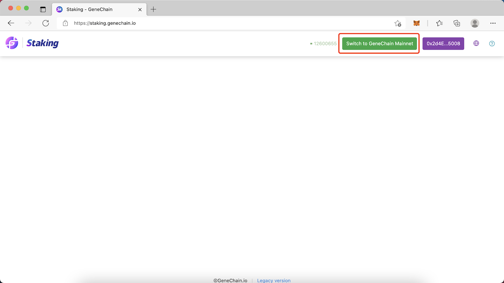 
2. If GeneChain is not configured in your MetaMask, a prompt will be shown to add GeneChain. Click `Approve` to complete adding. 
3. Click `Switch network` to finish network switching.  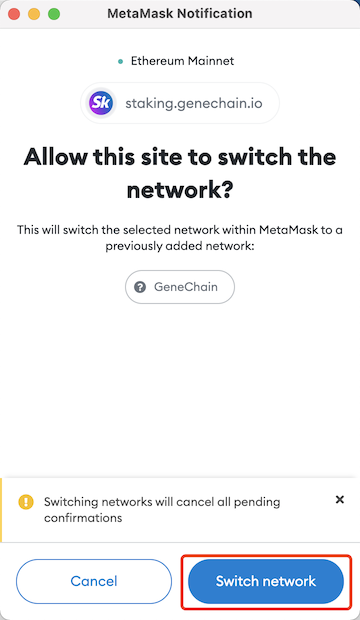 

## Stake a candidate

You can now find all `Active Validators` and `Validator Candidates` and select an active validator or a validator candidate to stake by clicking the `Stake` button.

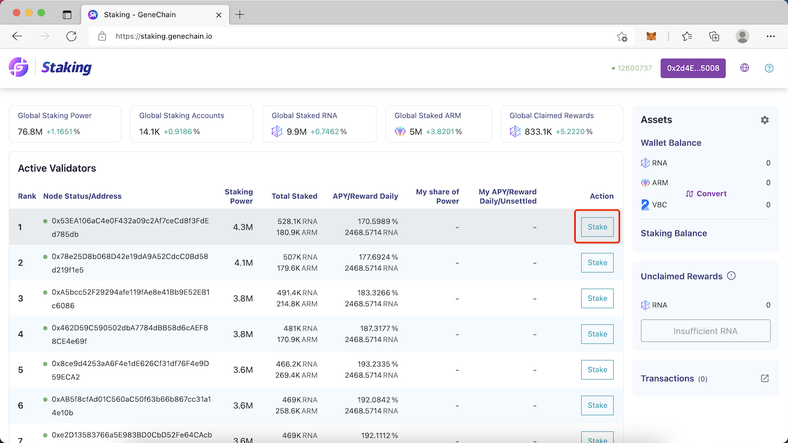

Enter the amount of RNA and ARM that you want to stake and then click the `Stake` button bellow.

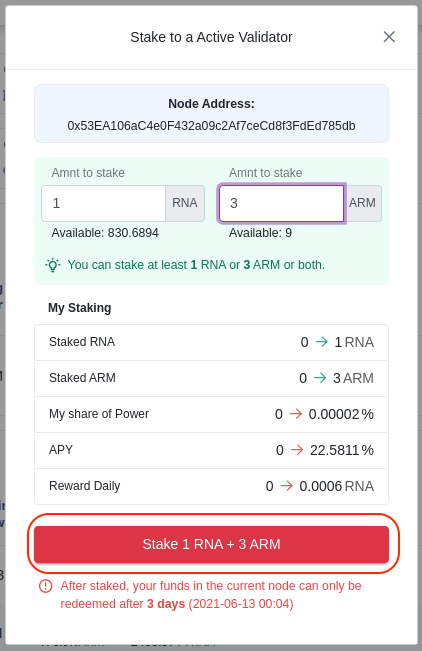

If you want to stake ARM and the Ribose system contract is not allowed to use your ARM yet, a prompt will be shown and you need to click `Confirm` to approve the Ribose system contract to use your ARM.

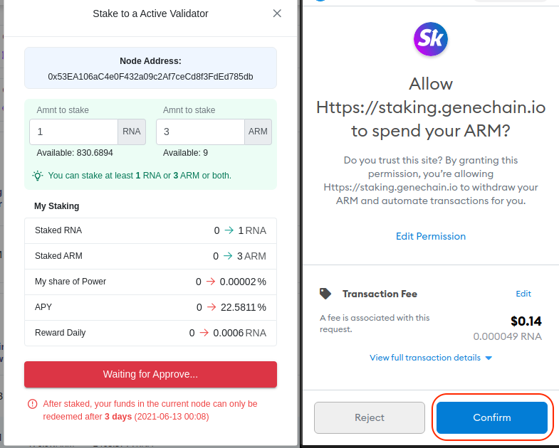

Wait for the approving transaction to be confirmed and then a prompt will be shown which is the staking transaction. Now you can click `Confirm` to send the staking transaction.

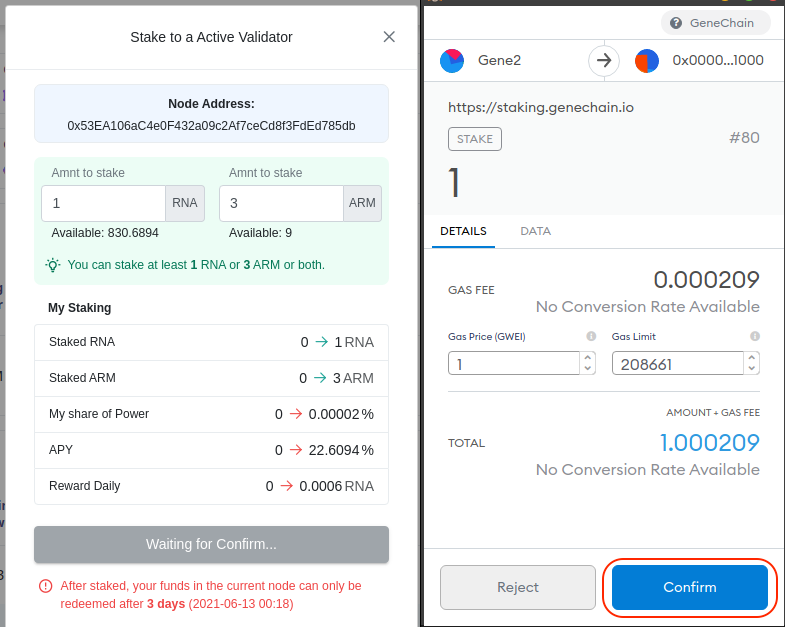

After the staking transaction is confirmed, you can find the staking record in `My Staked Nodes`.

### **Staking Notes**

1. You can stake at most 5 candidates.
2. You can not unstake a candidate within 86400 blocks which is about 72 hours since your last staking to the same candidate.
3. You can stake either RNA or ARM or both. But according to the [calculation of staking power](../../for-developers/ribose-consensus-protocol.md#staking-power), staking power can not be greater than zero without staking RNA.
4. You can stake with out ARM, but if you want to, you need to stake at least 3 ARMs.
5. If you decide to stake a validator candidate, do remember that you can get staking reward only if this validator candidate becomes an active validator and only top 21 validator candidates are selected as active validators.

## Unstake a candidate

You can unstake a candidate by clicking `Redeem` button in your staked nodes.

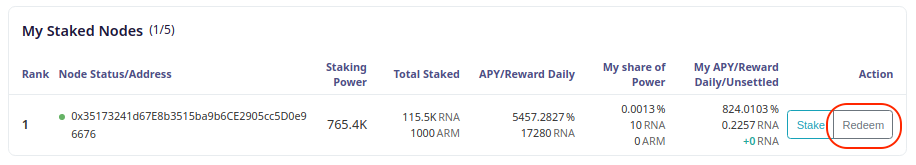

Enter the amount you want to unstake and click `Redeem`

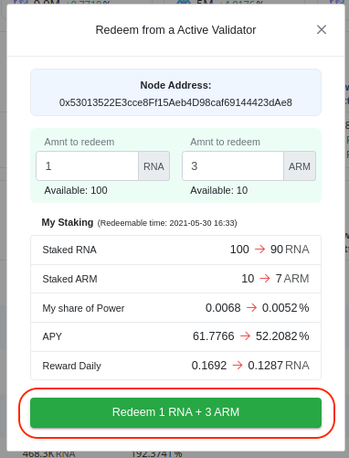

Click `Confirm` to send the transaction and wait for confirmation.

## Claim mining rewards

Your unclaimed rewards including both settled and unsettled rewards can be found in the `Assets` area. You can claim them by clicking the `Claim` button.

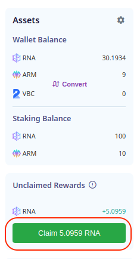

Two prompts might be shown, the first one is to settle unsettled rewards, the second one is to withdraw all settled rewards. You need to confirm them all to complete the claiming.

## Settings

Settings can be opened by clicking the gear icon in the upper right corner.

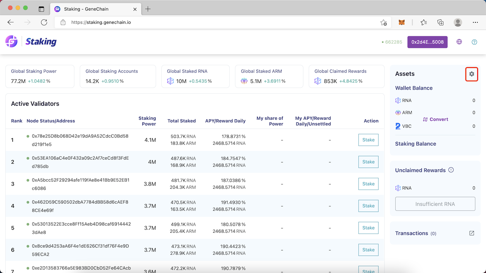

### RADR Address

You can set your RADR address to get your staked VBC included in original RADR network issuance calculation. Make sure you entered the correct address as we know nothing about your RADR address. But you can change it later. For more on how this works, please refer to [How to get ARM](how-to-get-arm.md#set-memo-to-get-included-in-original-radr-network-issuance-calculation).

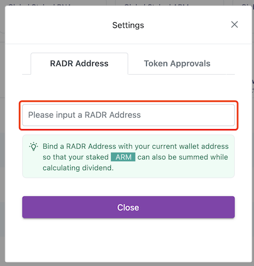

### Token Approvals

In this setting, there are two switches.

1. The first one is to allow the Ribose system contract to use your ARM. This is required when staking ARM.
2. The second one is to allow ARM contract to use your VBC, which is required when minting ARM with VBC. You can find more information in [How to get ARM](how-to-get-arm.md#stake-vbc-to-get-arm).

You can turn them on or off at any time. 

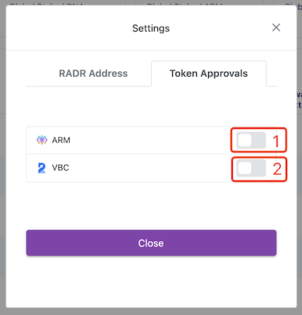

