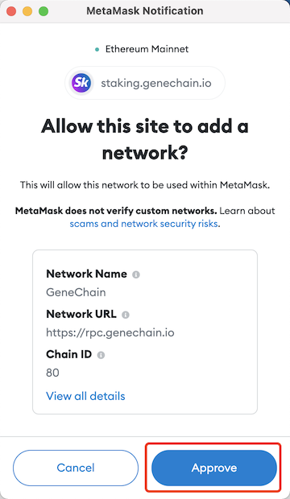

# 质押挖矿

质押可以通过调用 Ribose 系统合约的 `stake` 方法来完成。您可以在合约[源代码](https://github.com/genechain-io/system-contract/blob/master/contracts/Ribose.sol)中找到更多信息。

一个简单的方法是使用 [质押页面](https://staking.genechain.io)。这是有关如何使用质押页面的简单指南。

## 软件要求

MetaMask 是必需的，需要在与质押页面交互之前正确配置。如果没有，请先按照[如何使用MetaMask](../metamask.md)中的步骤安装和配置MetaMask。

## 连接钱包

您需要将质押页面与 MetaMask 连接并授权质押页面使用您的账户与 Ribose 系统合约进行交互。这可以通过以下步骤来完成。

1. 在[质押页面](https://staking.genechain.io)点击`连接钱包`。 
2. 选择 MetaMask 
3. 选择您要使用的帐户，然后单击`下一步`。 
4. 点击`连接`完成连接。 

## 切换到基因链

如果 MetaMask 中的网络已经切换到 GeneChain，则跳过此步骤。

1. 点击`Switch to GeneChain Mainnet`通知MetaMask切换网络。 
2. 如果您的 MetaMask 中未配置 GeneChain，则会显示添加 GeneChain 的提示。点击`Approve`完成添加。 
3. 点击`Switch network`完成网络切换。 

## 质押候选人

您现在可以找到所有`运行中的验证节点`和`候选节点`，并通过单击`质押`按钮选择要质押的活跃验证者或候选验证者。

输入您想要质押的 RNA 和 ARM 的数量，然后单击下面的`质押`按钮。

如果您想质押ARM，并且还未允许Ribose系统合约使用您的ARM，则会出现提示，您需要点击`确认`以批准Ribose系统合约使用您的ARM。

授权使用ARM的交易被确认后会显示质押交易，现在您可以点击`确认`发送质押交易。

质押交易确认后，您可以在`我质押的节点`中找到质押记录。

### 注意事项

1. 您最多可以质押 5 个候选人。
2. 您需在上一次质押同一候选人 86400 个区块（约72小时）后才可取回对同一候选人的质押。
3. 您可以质押 RNA 或 ARM 或两者。但是根据[staking power的计算](../../for-developers/ribose-consensus-protocol.md#staking-power)，在不质押RNA的情况下，staking power将始终为零。
4. 可以不使用 ARM 进行质押，但如果您想质押，则至少需要质押 3 个 ARM。
5. 如果您决定质押一名验证人候选，请记住，只有当该候选验证人成为活跃验证人时您才能获得质押奖励，并且，只有前 21 名候选验证人被选为活跃验证人。

## 取回对候选人的质押

您可以通过单击质押节点中的`赎回`按钮取会对候选人的质押。

输入您要取回的金额，然后单击`赎回`

点击`确认`发送交易并等待确认。

## 领取质押收益

您的待领取奖励，包括已结算和未结算的奖励，都可以在`资产`区域找到。您可以通过单击`领取`按钮来领取它们。

可能会出现两个提示，第一个是结算未结算的奖励，第二个是领取所有已结算的奖励。您需要全部确认以完成领取挖矿奖励。

## 设置

单击右上角的齿轮图标可以打开设置。

### RADR地址

您可以设置您的 RADR 地址，让您质押的 VBC 包含在原始 RADR 网络发行计算中。 请确保您输入了正确的地址，因为我们对您的 RADR 地址一无所知。 但是您可以稍后更改它。 有关其工作原理的更多信息，请参阅[如何获得ARM](how-to-get-arm.md#she-zhi-memo-yi-bao-han-zai-yuan-shi-radr-wang-luo-fa-hang-shou-yi-ji-suan-zhong)。

### 使用授权

在此设置中，有两个开关。 

1. 第一个是允许 Ribose 系统合约使用你的 ARM。 这是抵押 ARM 必需的。 
2. 第二个是允许 ARM 合约使用您的 VBC，这在使用 VBC 铸造 ARM 时必需的。 

您可以在[如何获得ARM](how-to-get-arm.md#tong-guo-zhi-ya-vbc-huo-de-arm)中找到更多信息。 您可以随时打开或关闭它们。

