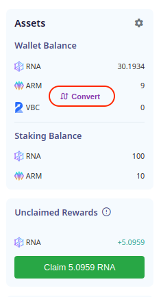
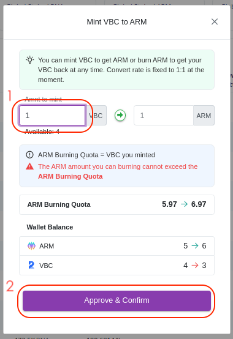
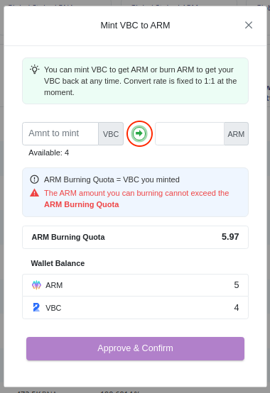
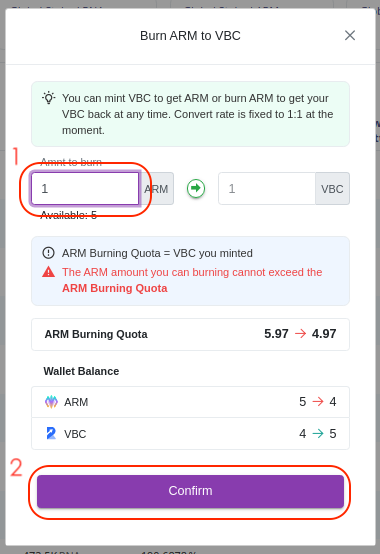

# How to get ARM

Here are some core concepts and a simple guide on how to stake VBC to get ARM and set memo to get included in original RADR network issuance calculation with [staking page](https://staking.genechain.io).

## Core Concepts

### Mint ARM

ARM can be minted by staking VBC to ARM contract. This can be done by calling the `exchange` method of ARM contract. Exchange rate is fixed to 1:1 in the ARM contract.

The amount of VBC staked to ARM contract is stored in the contract and can be included in the mortgagor balance for the purpose of calculating issuance proceeds in the original RADR network.

**Please Note: ONLY** account that has staked VBC can get VBC back by burning ARM and the limit of burning is the remaining staked amount. Do remember to backup your secret key in a secure way, or you might not be able to get your staked VBC back.

### Burn ARM

You can burn ARM to get your staked VBC back. This can be done by calling the `burn` method. But you can not burn ARM more than your remaining amount of staked VBC. The rate is also fixed to 1:1.

### Set Memo

To get your staked VBC included in original RADR network issuance calculation, you need to set your RADR address as your memo in ARM contract. This can be done by calling the `setMemo` method. All the amount of your staked VBC will be included into original RADR network issuance calculation according to [Third-party Issuance Interface Instructions](https://wiki.radarlab.org/en/introduction/third_party_access/).

## **Stake VBC to get ARM**

Click `Convert` button on the right side to start staking VBC to get ARM.

Enter the amount of ARM you want to mint and then click `Approve & Confirm` or just click `Confirm` if you already approved.

Confirm the approve transaction if necessary and confirm the exchange transaction. Then you will see ARM minted to your account.

**Note:** You need to have enough VBC to mint ARM. The rate is fixed to 1:1 in the ARM contract.

## **Set memo to get included in original RADR network issuance calculation.**

This can be easily done by entering your RADR address in settings and click `Confirm`. Note: Make sure you entered the correct address as we know nothing about your RADR address. But you can change it later.

## **Get your VBC back**

Open the Convert dialog and click the arrow button to switch to burning mode.

Just enter the amount of ARM to change to VBC and click `Confirm`, your VBC will be back once the burning transaction is confirmed.

**Note**: You can not burn ARM more than the amount of VBC you have staked. The rate is also fixed to 1:1.

